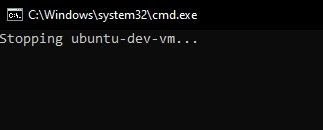
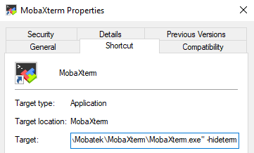
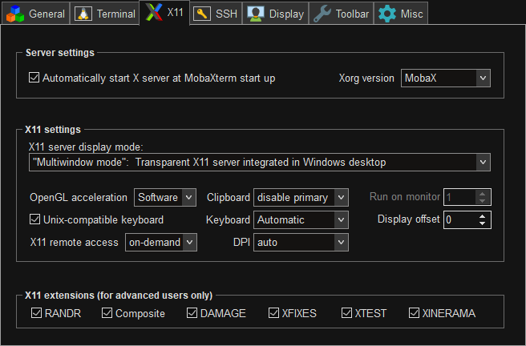
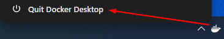
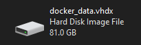
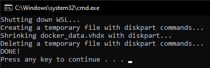
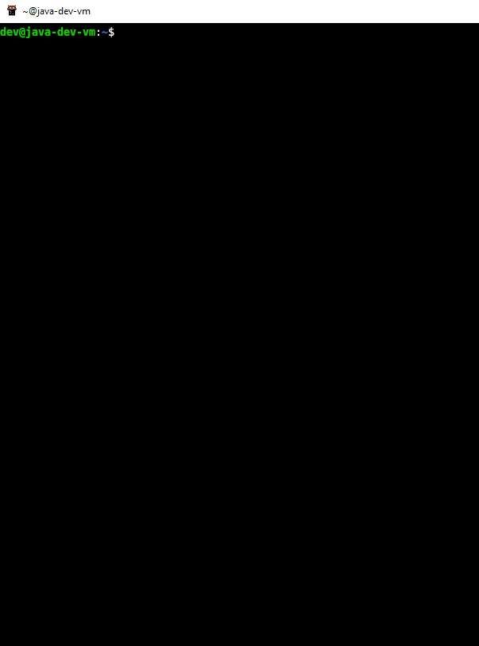

<p align="center">
    
</p>

<p align="center">
  <a href="src/docker/Dockerfile" rel="noreferrer">
      
  </a>
  <a href="https://hub.docker.com/r/javowiec/java-dev-vm" rel="noreferrer">
      
  </a>
  <a href="https://github.com/p-marcin/java-dev-vm/releases" rel="noreferrer">
      
  </a>
  <a href="LICENSE" rel="noreferrer">
      
  </a>
  <br>
  <a href="https://github.com/p-marcin/java-dev-vm/actions/workflows/main.yaml" rel="noreferrer">
      
  </a>
  <a href="https://github.com/p-marcin/java-dev-vm/actions/workflows/attestation-verification.yaml" rel="noreferrer">
      
  </a>
</p>

## :pushpin: Introduction

The **Java DEV VM** is a **powerful development environment** designed specifically **for Java Developers working on
Windows**. This Virtual Machine is based on Ubuntu, providing a familiar Linux environment that integrates seamlessly
with Windows through Docker Desktop.

The main advantage of the Java DEV VM is its **time-saving** nature. Developers no longer need to spend valuable time
manually setting up their development environment or installing the necessary tools. Everything you need - such as Java,
IDE,
build tools, Version Control System, Docker, Kubernetes and so on - is **pre-configured and ready to go right out of the
box**.

With the Java DEV VM, developers can **focus on writing code and delivering high-quality software**, instead of worrying
about installation issues or environment configuration. It's an ideal solution for anyone looking for a streamlined,
efficient, and hassle-free Java development experience.

It requires **3** dependencies:

* [**WSL version 2**](https://learn.microsoft.com/en-us/windows/wsl/install) (Windows Subsystem for Linux) - lets you
  install a Linux distribution and use Linux applications, utilities, and Bash command-line tools directly on Windows,
  unmodified, without the overhead of a traditional virtual machine or dualboot setup
* [**Docker Desktop**](https://docs.docker.com/desktop/install/windows-install/) - lets you build, share, and run
  containerized applications and microservices. It provides a straightforward GUI (Graphical User Interface) that lets
  you manage your containers, applications, and images directly from your machine
* [**MobaXterm Home Edition**](https://mobaxterm.mobatek.net/download.html) (X11 server) - lets you display
  applications (e.g. IntelliJ IDEA) from Java DEV VM on your Windows

Java DEV VM image can be pulled from DockerHub: https://hub.docker.com/r/javowiec/java-dev-vm:

* `-community` version contains IntelliJ
  IDEA [Community Edition](https://www.jetbrains.com/products/compare/?product=idea&product=idea-ce)
* `-ultimate` version contains IntelliJ
  IDEA [Ultimate Edition](https://www.jetbrains.com/products/compare/?product=idea&product=idea-ce)

Container from image can be started with batch script (more in next section):



After container is started, you'll see the panel with the applications having graphical interface:


For example IntelliJ IDEA:


All applications having graphical interface (even the ones not included in the panel,
e.g. gedit text editor) open as a separate window which you can move
freely:


## :pushpin: First Setup and Start

### 1. Installation

Please follow linked official documentation and install all **3** dependencies mentioned above.

### 2. Setup

#### 2.1. WSL configuration file

You can place a `.wslconfig` file in `C:\Users\${username}` where you can configure the amount of memory or the number
of logical processors you want to assign to Docker Desktop.

Example:

```
[wsl2]
memory=10GB
processors=6
swap=0
```

Full documentation: https://learn.microsoft.com/en-us/windows/wsl/wsl-config#wslconfig

#### 2.2. MobaXterm Home Edition

MobaXterm Home Edition consumes really low RAM (around 20MB, with IntelliJ IDEA open only 43,5MB RAM), so I suggest to
make it run with Windows startup:

* Run `Windows Key` + `R` shortcut and type: `shell:startup`
* Add MobaXterm shortcut to `Autostart` directory
* To start MobaXterm immediately minimized into the system tray add `-hideterm` property after `MobaXterm.exe"` in the
  Target field in Shortcut tab:



Also, consider changing default settings. You can change the settings to below ones by right-clicking MobaXterm tray
icon -> Show terminal -> Settings -> Configuration -> X11:



Then, to turn MobaXterm window back to tray icon go to: View -> Iconify MobaXterm.

### 3. Start

Make sure MobaXterm is started. Then start Docker Desktop. After that start Java DEV VM container. Enjoy!

See example batch script which starts or restarts Java DEV VM: [restart.bat](batch-scripts/restart.bat). Change the
value of `imageVersion` variable if there is newer version available.

Batch scripts can be executed on Windows in CMD/PowerShell or with double mouse click.

### 4. Quit

Quit Docker Desktop to quit Java DEV VM.

## :pushpin: Persisting changes

By default, Docker containers do not persist changes. You'll need to
use [volumes](https://docs.docker.com/storage/volumes/) to enable persistence.

In [restart.bat](batch-scripts/restart.bat) I defined **5** volumes:

* `projects` under `/home/dev/projects` - a place where you can start your projects
* `maven` under `/home/dev/.m2/repository` - local Maven repository where artifacts are
  stored
* `home` under `/home/dev` - home directory of Java DEV VM user
* `docker` under `/var/lib/docker` - a place where Docker stores the data (e.g. downloaded images)
* `/mnt/shared` - a shared place between Java DEV VM and `C:\Users\${username}\shared` on Windows

## :pushpin: Known Issues

### VHDX disk grows over time

This issue has been resolved in Docker Desktop 4.34. Just quit Docker Desktop in order to reclaim disk space.

<details>
  <summary>For Docker Desktop older than 4.34 click here</summary>
  <br>
  Deleting data in Docker Desktop (e.g. images, volumes) does not cause the size
  of <a href="https://en.wikipedia.org/wiki/VHD_(file_format)">VHDX (Virtual Hard Disk)</a> to decrease. Once the VHDX grows it will
  remain that size, or grow larger as the amount of data increases.

You can check the size of your Docker Desktop VHDX file under path: `%LOCALAPPDATA%\Docker\wsl\disk` (`%LOCALAPPDATA%`
is Windows environment variable which resolves to `C:\Users\${username}\AppData\Local`).

If you want to recover some of the disk space on Windows that is being consumed by the VHDX, you can shrink the VHDX.

See example batch script which automates the shrinking of VHDX
via [diskpart](https://learn.microsoft.com/en-us/windows-server/administration/windows-commands/diskpart) Windows
utility: [shrink-vhdx.bat](deprecated/scripts/shrink-vhdx.bat). Change the value of `vhdxFile` and `vhdxPath` variables
if
the name/path of your VHDX is different.

:warning: **WARNING: Shut down Docker Desktop before running the script!**



Before:



Shrinking:



After:


</details>

### Firefox can crash if shared memory size is too low

To prevent crashes from happening when running Firefox inside Java DEV VM, the size of the shared memory located at
`/dev/shm` must be increased. The issue is documented [here](https://bugzilla.mozilla.org/show_bug.cgi?id=1338771#c10).

By default, the size in Docker containers is **64MB**, which is not enough. It is recommended to use a size of **2GB**.
This value is arbitrary, but known to work well. Setting the size of `/dev/shm` can be done by adding the
`--shm-size 2g` parameter to the `docker run` command. It is already added to [restart.bat](batch-scripts/restart.bat).

### Missing `overlay2` Storage Driver

To check the Storage Driver inside Java DEV VM run command: `docker info 2>/dev/null | grep "Storage Driver"`. If it
is not `overlay2`, it means you're missing `--mount source=docker,target=/var/lib/docker` parameter in `docker run`
command. It is already added to [restart.bat](batch-scripts/restart.bat).

Thanks to this, Docker can use `overlay2` as a Storage Driver, otherwise it falls back to `vfs`. Using `vfs` may cause
issues when creating a k3s kubernetes cluster with [k3d](https://k3d.io).

## :pushpin: Useful Scripts

On Java DEV VM there are some [useful scripts](src/docker/scripts) which you can use.

<details>
  <summary>Click here to see an example</summary>
  <br>
  <p>If you want to check versions installed (see
  also <a href="https://github.com/p-marcin/java-dev-vm/releases">Releases</a> tab), type:</p>
  
</details>

## :pushpin: Useful Aliases

In [`/home/dev/.bash_aliases`](src/docker/home-config/.bash_aliases) you can find some useful aliases which you can use.

## :pushpin: Useful Docs

* [Accessing application in a Windows browser](docs/accessing-application-in-a-windows-browser.md)
* [Certificate Setup](docs/certificate.md)
* [Verifying Provenance and SBOM Attestations](docs/provenance-and-sbom.md)

## :pushpin: How to build image locally?

Clone or download as a ZIP this repository.

Install Java on Windows: https://www.oracle.com/java/technologies/downloads/

Then use [Maven wrapper](https://maven.apache.org/wrapper/): [mvnw.cmd](mvnw.cmd) and type in PowerShell:

* to build `-community` image:

```bash
.\mvnw.cmd clean install -DskipTests -Pcommunity
```

* to build `-ultimate` image:

```bash
.\mvnw.cmd clean install -DskipTests -Pultimate
```

If you want to remove builder cache, use `prune-builder` Maven profile or open Docker Desktop, go to Volumes tab and
remove `buildx_buildkit_java-dev-vm-builder0_state` volume manually.

Older releases are removed from DockerHub. If you want to use older release for whatever reason, you need to build it
yourself. In the [Releases](https://github.com/p-marcin/java-dev-vm/releases) tab you can find zip with the source
code.

## 💖 Support

Hey there! If you enjoy my work and would like to support me, consider buying me a coffee! :slightly_smiling_face: Your
contributions help me keep creating, and I truly appreciate every bit of support you offer.

<p>
  <a href="https://www.buymeacoffee.com/p.marcin" rel="noreferrer">
    
  </a>
</p>

Also, please consider giving this project a ⭐ on GitHub. This kind of support helps promote the project and lets others
know that it's worth checking out.

Thank you for being amazing!

## :pushpin: Copyright & License

Copyright © 2024 Marcin P.

Licensed under the Apache License, Version 2.0 (the "License");
you may not use this file except in compliance with the License.
You may obtain a copy of the License at

    https://www.apache.org/licenses/LICENSE-2.0

Unless required by applicable law or agreed to in writing, software
distributed under the License is distributed on an "AS IS" BASIS,
WITHOUT WARRANTIES OR CONDITIONS OF ANY KIND, either express or implied.
See the License for the specific language governing permissions and
limitations under the License.
