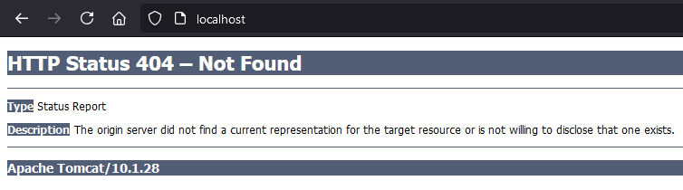

# Accessing application in a Windows browser

## :pushpin: Prerequisites

Make sure that you start Ubuntu DEV VM with `-p 80:80` flag (like in [restart.bat](../batch-scripts/restart.bat)). It will map `80` host (Windows) port to `80` container port.

If you don't use Docker/Kubernetes to deploy your application, and it runs on `80` port on Ubuntu DEV VM, you can already access it in a Windows browser (e.g. Firefox) under url: `http://localhost`

Otherwise, you need additional steps mentioned in next sections.

## :pushpin: Docker

If you deploy your application inside Ubuntu DEV VM using Docker, you also need to map `80` host (Ubuntu DEV VM) port to `8080` container port.

Example:

`docker run -it --rm -p 80:8080 tomcat`

## :pushpin: Kubernetes

### Traefik Ingress Controller (default)

If you deploy your application inside Ubuntu DEV VM using Kubernetes, you need to map `80` host (Ubuntu DEV VM) port to `80` Load Balancer (Ingress) port when creating a cluster:

`k3d cluster create --image "rancher/k3s:v$(kubectl version --client | grep "Client Version:" | sed "s/.*v//")-k3s1" --api-port 6443 --agents 1 -p "80:80@loadbalancer"`

After that you can create some deployment:

`kubectl create deployment tomcat --image tomcat`

Create also a ClusterIP service for it which maps `8080` port inside a cluster to `8080` port of the Pod within Deployment:

`kubectl create service clusterip tomcat --tcp=8080:8080`

Now, create `ingress.yaml` file which maps `80` Load Balancer (Ingress) port to `8080` ClusterIP service port:

```yaml
apiVersion: networking.k8s.io/v1
kind: Ingress
metadata:
  name: tomcat
  annotations:
    ingress.kubernetes.io/ssl-redirect: "false"
spec:
  ingressClassName: traefik
  rules:
  - http:
      paths:
      - path: /
        pathType: Prefix
        backend:
          service:
            name: tomcat
            port:
              number: 8080
```

and create an ingress object with command:

`kubectl apply -f ingress.yaml`

### Nginx Ingress Controller

If you deploy your application inside Ubuntu DEV VM using Kubernetes, you need to map `80` host (Ubuntu DEV VM) port to `80` Load Balancer (Ingress) port when creating a cluster and disable deployment of default Traefik Ingress Controller:

`k3d cluster create --image "rancher/k3s:v$(kubectl version --client | grep "Client Version:" | sed "s/.*v//")-k3s1" --api-port 6443 --agents 1 -p "80:80@loadbalancer" --k3s-arg "--disable=traefik@server:0"`

Next, deploy [Nginx Ingress Controller](https://github.com/kubernetes/ingress-nginx/releases):

`kubectl apply -f https://raw.githubusercontent.com/kubernetes/ingress-nginx/controller-v1.11.1/deploy/static/provider/cloud/deploy.yaml`

After that you can create some deployment:

`kubectl create deployment tomcat --image tomcat`

Create also a ClusterIP service for it which maps `8080` port inside a cluster to `8080` port of the Pod within Deployment:

`kubectl create service clusterip tomcat --tcp=8080:8080`

Now, create `ingress.yaml` file which maps `80` Load Balancer (Ingress) port to `8080` ClusterIP service port:

```yaml
apiVersion: networking.k8s.io/v1
kind: Ingress
metadata:
  name: tomcat
  annotations:
    ingress.kubernetes.io/ssl-redirect: "false"
spec:
  ingressClassName: nginx
  rules:
  - http:
      paths:
      - path: /
        pathType: Prefix
        backend:
          service:
            name: tomcat
            port:
              number: 8080
```

and create an ingress object with command:

`kubectl apply -f ingress.yaml`

## :pushpin: Tomcat server in a Windows browser

If you go to `http://localhost` you'll see Tomcat server page which returns a 404 since there are no webapps loaded by default. Anyway, the request from Windows reaches Tomcat server deployed on Ubuntu DEV VM:


