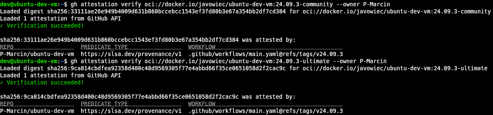

# Verifying Provenance and SBOM Attestations

## :pushpin: Verify Attestation with GitHub CLI

With [GitHub CLI](https://cli.github.com/) you can verify the Integrity and Provenance of a Docker Image using its
associated
cryptographically signed Attestations.

In order to verify an Attestation, you must validate the identity of the GitHub Actions workflow that produced the
Attestation (a.k.a. the signer workflow). Given this identity, the verification process checks the signatures in the
Attestations, and confirms that the Attestation refers to provided Docker Image.

Verify Attestation with the following command:

```shell
gh attestation verify oci://docker.io/javowiec/java-dev-vm:XX.XX.X-community --owner P-Marcin
```



The Attestation Verification is also scheduled
here: https://github.com/P-Marcin/java-dev-vm/actions/workflows/attestation-verification.yaml

## :pushpin: Verify Provenance attached to the image

The Provenance Attestations include facts about the build process, including details such as:

* Build timestamps
* Build parameters and environment
* Version control metadata
* Source code details
* Materials (files, scripts) consumed during the build

Check: [Inspecting Provenance](https://docs.docker.com/build/metadata/attestations/slsa-provenance/#inspecting-provenance)
in docker documentation.

Verify Provenance attached to the image with the following command:

```shell
docker buildx imagetools inspect javowiec/java-dev-vm:XX.XX.X-community --format "{{ json .Provenance.SLSA }}" > provenance.slsa.json
```

## :pushpin: Verify SBOM attached to the image

Software Bill of Materials (SBOM) Attestations describe what software artifacts an image contains, and artifacts used to
create the image. Metadata included in an SBOM for describing software artifacts may include:

* Name of the artifact
* Version
* License type
* Authors
* Unique package identifier

Check: [Inspecting SBOMs](https://docs.docker.com/build/metadata/attestations/sbom/#inspecting-sboms)
in docker documentation.

Verify SBOM attached to the image with the following command:

```shell
docker buildx imagetools inspect javowiec/java-dev-vm:XX.XX.X-community --format "{{ json .SBOM.SPDX }}" > sbom.spdx.json
```

You can also list packages of the image with the following command:

```shell
docker scout sbom javowiec/java-dev-vm:XX.XX.X-community --platform linux/amd64 --format list > sbom.list.txt
```
